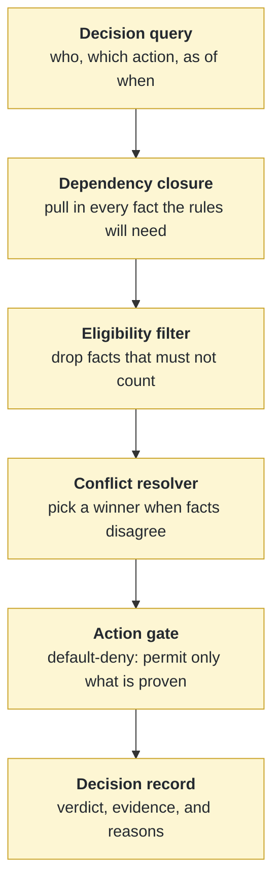

# LGR for Action-Safe Enterprise Knowledge Graphs

Lifecycle-Governed Retrieval (LGR) and the EvoMem-Enterprise benchmark: reference
implementation, generated benchmark, validation-only label checkers, conformance
suite, and raw evaluation outputs for the manuscript *Lifecycle-Governed
Retrieval for Action-Safe Enterprise Knowledge Graphs*.

## The problem, in one example

A customer asks a support assistant for a refund. The assistant searches company
records, finds *"this customer is on the Premium plan"*, and issues the refund.

Three things could have made that wrong:

- The Premium record was **superseded** last month — the customer is on Standard now.
- The record came from a **less authoritative system** than one that says otherwise.
- The refund **case had not reached the state** where a refund is permitted.

Ordinary retrieval ranks facts by how well they *match the question*. None of the
three failures above is a matching failure — every one of those records is
topically perfect. They are failures of **whether the fact was still allowed to
authorize an action at that moment.**

LGR separates those two questions. Finding candidate facts stays pluggable;
LGR decides which of them may support an action, and refuses to act when it
cannot prove one may.

## How it works

Facts are stored as **assertion events** rather than plain statements: each one
records when it was true, when it was written down, where it came from, which
policy and vocabulary version it belongs to, and what it replaced. A decision
then runs through five stages, and a fact must survive all of them.



The **eligibility filter**, **conflict resolver**, and **action gate** all read the
same versioned *governance tables* — trust order, policies, workflows, vocabulary
versions. The filter and the resolver write a *reason code* for every fact they
exclude, which is what makes a refusal explainable rather than a shrug.

| Stage | Plain-language job | Rejects, for example |
|---|---|---|
| **Dependency closure** | Gather the facts the rules depend on, not just the ones that look relevant | A guard silently passing because its input was never retrieved |
| **Eligibility filter** | Remove facts that are not allowed to count right now | Expired, superseded, wrong-policy-version, or poorly-sourced records |
| **Conflict resolver** | When two eligible facts disagree, decide which wins | The Standard record beats the older Premium one; a genuine tie blocks the action |
| **Action gate** | Permit an action only with a registered rule, a valid workflow state, and evidence bound to the right customer | A refund justified by *another* account's active subscription |
| **Decision record** | Write down the verdict, the evidence behind it, and the reason for every exclusion | Nothing — this is the audit trail, and it replays identically |

Two properties do the real work. **Default-deny:** an action is refused unless
every requirement is positively proven, so incomplete evidence produces
abstention rather than a guess. **Recorded reasons:** every excluded fact carries
a reason code, so a refusal can be explained and re-checked later.

This is a **design-and-pilot artifact, not a production-safety validation.**
Every world in the benchmark is generated by one generator family.

## Requirements

Python 3.11+ and the standard library only — there are no third-party runtime
dependencies. `pytest` is optional (the suite also runs under `unittest`).

## Quick start

```bash
git clone https://github.com/<you>/lgr-action-safe-enterprise-kg.git
cd lgr-action-safe-enterprise-kg
python3 -m pytest tests/ -q
```

Expected: **57 passed**.

## Reproducing the published results

Run these from the repository root, in order. Each is read-only with respect to
the committed benchmark unless stated otherwise.

**1. Validate the frozen benchmark and its labels.**

```bash
python3 scripts/validate_evomem_enterprise.py
python3 scripts/verify_gold_labels.py
python3 scripts/verify_evidence_labels.py
```

Each prints a JSON report ending in `"status": "pass"`. The two `verify_*`
scripts are validation-only: they import neither the evaluated operator nor the
label generator, and they never write to the benchmark.

**2. Reproduce the single-world pilot** (Tables III–IV, Figure 4).

```bash
python3 scripts/reproduce_lgr_release.py --output-dir /tmp/lgr-repro
```

This regenerates every Phase 3 output from the committed inputs into a scratch
directory and confirms the frozen input hashes are unchanged. Compare against
`experiments/lgr_reproduction/`. All accuracy metrics match exactly; the
`retrieval_latency_ms` and `end_to_end_proxy_latency_ms` fields are wall-clock
measurements and will differ on your machine.

**3. Reproduce the 15-world multiworld result** (Figure 3, the `+0.215` mean).

The four bulk derived file classes are not committed (see *What is and is not in
this repository*). Regenerate them in place:

```bash
python3 scripts/run_multiworld_experiments.py \
    --output-dir data/evomem_enterprise_v3/worlds \
    --resume --rerun-evaluation
```

Then check `data/evomem_enterprise_v3/worlds/multiworld_summary.json`. A
from-scratch regeneration reproduces the published summary at full precision:
`lgr_minus_comparator_mean = 0.21484215235427065`, 95% world-bootstrap interval
`[0.2118, 0.2179]`, and 1500/1500 evidence plus 635/635 action agreement with the
standalone comparator.

**4. Conformance and the independent comparator.**

```bash
python3 scripts/run_lgr_conformance.py
python3 scripts/composed_governance_baseline.py --output /tmp/composed.json
```

The comparator imports neither `lgr_operator.py` nor the label generators; it
composes the same declared governance tables independently and should report
100/100 evidence and 40/40 action agreement on the frozen split.

## Determinism: a caveat that matters

Assertion events, tasks, and every reported metric are deterministic given the
seed. **Gold label files are not byte-reproducible.** Some label lists are built
from Python sets, so their element *order* depends on the per-process string hash
seed. Two runs with the same seed produce set-identical, byte-different
`gold_*.jsonl`.

Consequences:

- The committed `generated/` files are the canonical labels and are checked by
  hash. **Do not regenerate them in place** — you will get set-equivalent files
  with different bytes and the frozen-hash check will fail.
- Setting `PYTHONHASHSEED=0` makes regeneration reproducible *from that point
  forward*, but it does not reproduce the committed bytes, which were written
  under a different seed.
- Nothing in the reported results depends on this: every metric is computed over
  sets, and the multiworld summary above matches at full precision across an
  independent regeneration.

Sorting these lists at write time would remove the caveat, but it would change
the frozen label bytes and invalidate the published hashes, so it is deferred to
a future benchmark version.

## What is and is not in this repository

Committed:

- `scripts/` — generator, operator, experiment runners, validation-only checkers.
- `tests/` — 57 tests: 34 operator conformance cases over 29 requirement areas,
  plus generator conflict semantics, label-validator mutations, and comparator.
- `data/evomem_enterprise/` — the frozen single-world pilot, hash-checked.
- `data/evomem_enterprise_v3/worlds/` — all 15 worlds' inputs, per-world metrics,
  and summaries.
- `experiments/lgr_reproduction/` — the released Phase 3 outputs to compare against.
- `experiments/lgr_jws/protocol.json` — the pre-specified multiworld protocol and seeds.
- `submission/ickg_lgr_2026/` — manuscript source, PDF, and release documentation.

Not committed (regenerable; see `.gitignore`):

- `context_packets_*`, `llm_inputs_*`, `llm_proxy_predictions_*`, and
  `per_task_metrics_*` under each world's `phase3/` — roughly 410 MB of derived
  output, rebuilt by step 3 above.
- Release archives (`*.tar.gz`). Attach these to a GitHub Release or a Zenodo
  deposit instead; rebuild with
  `python3 scripts/build_lgr_artifact.py --release-candidate rc2`.

## Scope and limitations

All worlds share one generator family and its scenario assumptions. The number of
worlds is an engineering budget, not a power calculation. Passing the conformance
suite is not implementation conformance: each case is one branch on a constructed
or benchmark input. No language model is run; `llm_proxy_predictions_*` are a
deterministic proxy, not model outputs. See Section VII of the manuscript.

## License and citation

MIT, for both the code and the generated benchmark data — see [LICENSE](LICENSE).
Citation metadata is in [CITATION.cff](CITATION.cff); `.zenodo.json` is prepared
for an archival deposit that has not yet been made. No DOI is claimed.
